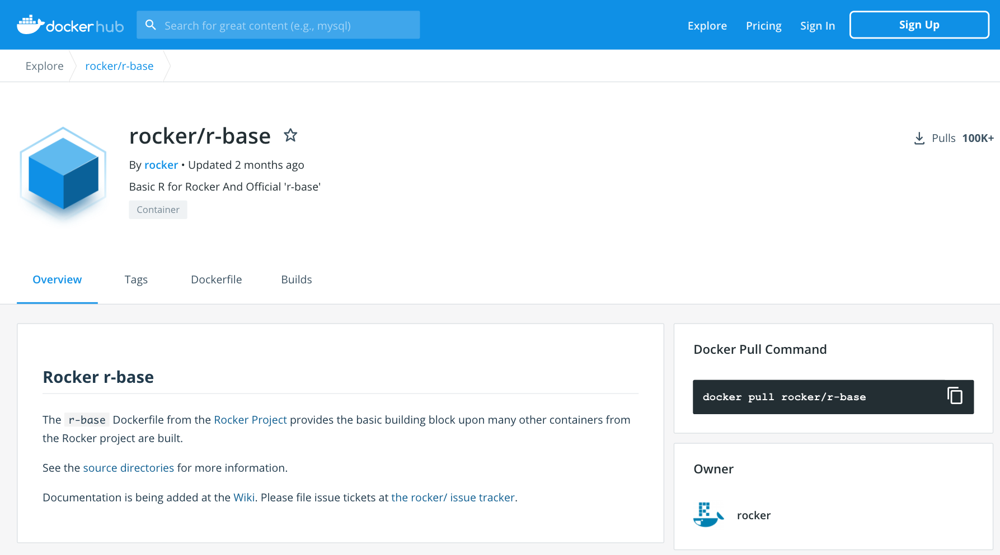
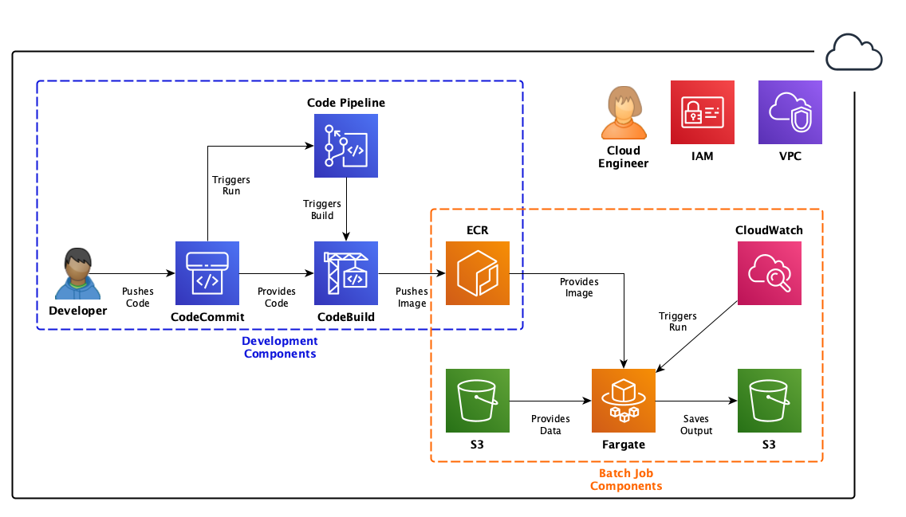

# R_Docker_Intro

# Intro to Docker: How Containerized Workflows Facilitate Reproducible and Shareable Code 

#### Stephanie LaHaye, PhD
##### WIA Summit Tutorial
##### Wednesday February 10, 2020
&nbsp;  
&nbsp;  


  


### Before we begin, a quick intro:
This interactive tutorial will introduce participants to the world of Docker and will underscore the reasons why Docker is an integral tool for anyone aiming to make their code more reproducible and shareable, and will also explain why it is essential when sharing to users in outside environments. We will learn how to launch Docker, check for images on our local systems, push and pull from Docker Hub, create a basic Dockerfile, and finally use it to run an Rscript. Before the presentation, please install Docker by following the instructions for [mac](https://docs.docker.com/docker-for-mac/install/), [linux](https://docs.docker.com/get-started/), or [windows](https://docs.docker.com/docker-for-windows/install/). I will be presenting from my Mac, so I will be using Mac Docker Desktop. Participants should also create a free account with [Docker Hub](https://hub.docker.com/) before begining the tutorial.
&nbsp;  
&nbsp;  
### Topics we will cover:
### [1.  What is Docker and why should we use it?](#anchor1)
### [2.  Launching Docker Desktop](#anchor2)
### [3.  Running Docker via command line](#anchor3)
### [4.  Pulling from Docker Hub (Rocker and friends!)](#anchor4)
### [5.  Create a Dockerfile and Build a Docker Image](#anchor5)
### [6.  Running our Docker Image: interactive and scripted runs](#anchor6)
### [7.  Copying Data out of a running Docker container to your host machine](#anchor7)
### [8.  Lets push our image to Docker Hub!](#anchor8)
### [9.  How all of this gets 10 times cooler with serverless technology and microservices!](#anchor9)

&nbsp;  
&nbsp;  
  

<a name="anchor1"></a>
# 1. What is Docker and why should we use it?
&nbsp;    
    

#### “Docker is an open platform for developing, shipping, and running applications.” - [Docker Docs](https://docs.docker.com/).
Docker Docs provides excellent documentation for almost any question you might have about Docker. We will refer back to Docker Docs often, and it is a great place to start reading as you being your journey into the world of more reproducible and shareable code through containerization!

&nbsp;  
&nbsp;  


###### To get started, lets discuss some of the major benefits to using Docker with your code/pipeline.

#### Benefits of Docker:
1. Provides ability to package and run application in a container  
2. Containers are lightweight (fast)  
3. Consistent and reproducible  
4. Self contained  
5. Responsive deployment and scaling  
&nbsp;  
&nbsp;

###### A question that a lot of people have...  
### Is using a container the same as using a virtual machine (VM)? (hint: NOPE)
  
[Photo cred](https://learn.kumul.us/)

#### What is a VM?
A VM runs on top of a physical server, and emulates a particular hardware system. A hypervisor (virtual machine monitor) is used to create and run the VM. A hypervisor is required to virtualize the server, and it lives in between the hardware and the VM. VMs are isolated from each other, and each has its own operating system/apps/allocated resources. Can be useful for developers who might want to test different applications on different "virtually set up" machines.

#### So how is that different from a "container"?
Containers, unlike VMs, are meant to be a way for an entire environment to be packaged up in a standardized way (i.e. a shipping container on a sea barge, see the docker logo...). Containers do not have a hypervisor, instead there is an engine that contains the bare minimum environment needed to run the application that is being hosted. It is a way for a developer to develop, test, and deploy code in a way that can ensure the reproducibility of the product in outside environments. A container can be run on a virtual or physical machine.
&nbsp;  

### So now we know... Containers =/= VMs
#### Docker container vs. VMs
##### Why you might choose Docker over VM for application development:
1. Containers are a more lightweight option, they start much faster, and use a fraction of the memory compared to booting an entire OS  
2. Plays will with microservices (i.e. within an AWS set up, see section 8 below)    
3. Ability to have a consistent environment (reproducible) and shareable to outside environments (no more dependency issues)
4. Easy to maintain versioning and updates (i.e. CodeCommit/CodePipeline in AWS)  

&nbsp;  
&nbsp;

###### Let's talk architecture...
## Breakdown of basic Docker Architecture and Objects

  
[Photo cred](https://docs.docker.com/get-started/overview/)

  
#### Docker daemon  
The Docker daemon (dockerd) listens for Docker API requests and manages Docker objects such as images, containers, networks, and volumes. A daemon can also communicate with other daemons to manage Docker services.  

#### Docker client
The Docker client is the primary way that many Docker users interact with Docker. When you use commands such as docker run, the client sends these commands to dockerd, which carries them out. The docker command uses the Docker API. The Docker client can communicate with more than one daemon.  

#### Docker registry
Docker registry stores Docker images. Docker Hub is a public registry that anyone can use, and Docker is configured to look for images on Docker Hub by default.   
  
### Docker objects
###### When you use Docker, you are creating and using images, containers, networks, volumes, plugins, and other objects.   
  
#### Docker image
An image is a read-only template with instructions for creating a Docker container. Often, an image is based on another image, with some additional customization. For example, you may build an image which is based on the ubuntu image, but installs the Apache web server and your application, as well as the configuration details needed to make your application run.  
  
#### Docker Container
A container is a runnable instance of an image. You can create, start, stop, move, or delete a container using the Docker API or CLI. You can connect a container to one or more networks, attach storage to it, or even create a new image based on its current state.  
&nbsp;    
&nbsp;  
<a name="anchor2"></a>
# 2. Launching Docker Desktop

#### Everyone should already have done this, but just a reminder to begin by installing Docker Desktop:
- mac (https://docs.docker.com/mac/step_one/)  
- linux (https://docs.docker.com/linux/step_one/)   
- windows (https://docs.docker.com/get-started/)  

##### I will be performing all presentation examples using Docker Desktop for Mac
My docker desktop version is 2.5.0.1 
  

&nbsp;  
Please note the Advanced Preferences where you can select CPUs and Memory (this is important if you do not have enough resources when building your image, as it will fail if you surpass the default setting)  
  

[More Info](https://docs.docker.com/docker-for-mac/)  
CPUs: By default, Docker Desktop is set to use half the number of processors available on the host machine. To increase processing power, set this to a higher number; to decrease, lower the number.  

Memory: By default, Docker Desktop is set to use 2 GB runtime memory, allocated from the total available memory on your Mac. To increase the RAM, set this to a higher number. To decrease it, lower the number.  

Swap: Configure swap file size as needed. The default is 1 GB.  

Disk image size: Specify the size of the disk image.  

Disk image location: Specify the location of the Linux volume where containers and images are stored.  

You can also move the disk image to a different location. If you attempt to move a disk image to a location that already has one, you get a prompt asking if you want to use the existing image or replace it.  
&nbsp;  
&nbsp;  
<a name="anchor3"></a>
## 3. Running Docker via command line

To ensure you have Docker properly installed, using the command line interface (CLI) run
```
docker
```
You should see this output (plus more, but reducing for this example):
```
Usage:	docker [OPTIONS] COMMAND

A self-sufficient runtime for containers

Options:
      --config string      Location of client config files (default
                           "/Users/username/.docker")
  -c, --context string     Name of the context to use to connect to the
                           daemon (overrides DOCKER_HOST env var and
                           default context set with "docker context use")
  -D, --debug              Enable debug mode
  -H, --host list          Daemon socket(s) to connect to
  -l, --log-level string   Set the logging level
                           ("debug"|"info"|"warn"|"error"|"fatal")
                           (default "info")
      --tls                Use TLS; implied by --tlsverify
      --tlscacert string   Trust certs signed only by this CA (default
                           "/Users/username/.docker/ca.pem")
      --tlscert string     Path to TLS certificate file (default
                           "/Users/username/.docker/cert.pem")
      --tlskey string      Path to TLS key file (default
                           "/Users/username/.docker/key.pem")
      --tlsverify          Use TLS and verify the remote
  -v, --version            Print version information and quit

```
You can also look for any images on your machine by running:

```
docker images
```

In response, you will see Repo IDs and info about your images (See headers below)

```
REPOSITORY      TAG     IMAGE ID      CREATED     SIZE
```

## Lets get started by making a very basic Dockerfile and directory structure 
```
mkdir Docker_Test
cd Docker_Test
touch Dockerfile
mkdir Test_Script
cd Test_Script
```

Now either download the Rscript: /R_Docker_Intro/Example_Data/Generate_tSNE.R
*-or-*
use vim/nano/etc and copy/past text from /R_Docker_Intro/Example_Data/Generate_tSNE.R to a new file called Generate_tSNE.R  

Your directory structure should now look like this:
```
├── Dockerfile
└── Test_Script
    └── Generate_tSNE.R
```

We are now ready to begin making our Dockerfile, but before we do so, lets introduce ourselves to Docker hub, which is where we will get the base image that we want to use.

&nbsp;  
&nbsp;  
<a name="anchor4"></a>
## 4. Pulling from Docker Hub (rocker)

### Check out Docker hub (rocker) https://hub.docker.com/u/rocker

  

##### Lets go ahead and pull the rocker version we want (its important to list a version if you want to maintain reproducibility)
```
docker pull rocker/r-base:4.0.2
```
You will see a download slowly occuring... as you pull this image to you local machine

example:
```
4.0.2: Pulling from rocker/r-base

.....info on layers here.....

Status: Downloaded newer image for rocker/base-r:4.0.2
docker.io/rocker/r-base:4.0.2
```

Now, check your docker images:
```
docker images
```
You should see a line that starts with (under the headers):
```
rocker/r-base
```

&nbsp;  
&nbsp;  
<a name="anchor5"></a>
## 5. Create a Dockerfile and Build a Docker Image

We are now ready to build our Dockerfile using the base rocker/r-base image.


##### A little background on this image:
"The r-base Dockerfile from the Rocker Project provides the basic building block upon many other containers from the Rocker project are built."  
&nbsp; 

Go to your text editor, and open up your Dockerfile, its time to set it up!
```
vi Dockerfile
```

```
FROM rocker/r-base:4.0.2
#R version 4.0.2
LABEL software.name="My First Docker Test"
LABEL software.version="v1.0"
LABEL software.description="Running tSNE analysis on iris data"
LABEL container.base.image="debian"
LABEL tags="Docker Test with R/rocker"

```

### BUILD your image
```
docker build -t docker_test .
```
* -t is short for --tag. It tells docker to tag the image with the provided tag. In this example our tag is docker_test
* The . (period) at the end of the command tells Docker to build the image based on the Dockerfile that is in the current working directory, your working directory when you run this should be the /Docker_Test directory that we made earlier.


&nbsp;  
&nbsp;  

<a name="anchor6"></a>
## 6. Running our Docker Image: interactive and scripted runs

### ENTRYPOINT in and test out R environment 
#### To test your docker container interactively, run the following command (alternatively you can use the image number instead of tagged name):

```
docker run --entrypoint /bin/bash -i -t docker_test:latest
```
* -i is short for --interactive. Keep STDIN open even if unattached.
* -t is short for --tty. Allocates a pseudo terminal that connects your terminal with the container’s STDIN and STDOUT.  

Upon running this command, you will can begin an R session by typing in "R" on the command line. Becuase R is already installed, you can check the R version once you have entered interactive R:
```
R
``` 
```
R.Version()
```
If your Docker Image was built successfully, this should run in an interactive R session and should allow you to perform any normal R functionalities within the container. Note, we have not yet installed any packages, this will just be base R.

To exit the r session:

```
quit()
```
and then the docker container:
```
exit
```

Our container is built and we have successfully tested R within an interactive session. It is now time to add a few lines to our Dockerfile to install required packages and to copy our script over to our container (Remember, the container is a completely insulated machine, it really won't be talking to our local machine while running, so we have to give it the files it needs to access)

## WARNING: R must be compiled, this step can take a few minutes! However, we will discuss the cache process and how to optimize your code to reduce time spent recompiling after each change

```
FROM rocker/r-base:4.0.2
#R version 4.0.2
LABEL software.name="My First Docker Test"
LABEL software.version="v1.0"
LABEL software.description="Running tSNE analysis on iris data"
LABEL container.base.image="debian"
LABEL tags="Docker Test with R/rocker"


##Install necessary R packages needed for tSNE generation
RUN R -e "install.packages(c('Rtsne', 'ggplot2'))"

#Copy Rscript over to container
COPY Test_Script/Generate_tSNE.R /home/analysis/Generate_tSNE.R

#Run the Rscript
RUN Rscript /home/analysis/Generate_tSNE.R
```

Once you have your Dockerfile saved, from the same level as the Dockerfile, build your updated image, this step can take some time.

```
docker build --tag docker_test .
```

&nbsp;  
### A little info on "cache"
  

Docker will step through the intructions for building the image based on your Dockerfile, and it does so *in the order they are listed*. While this is happening, Docker is actually checking for an existing image in its cache that it can reuse, *instead of* created a new (duplicate) image.

You can disable cache by using the --no-cache=true option on the docker build command.  

#### The basic cache rules that Docker follows are outlined below (Bullet points below are directly from [Docker Docs](https://docs.docker.com/develop/develop-images/dockerfile_best-practices/)):

* Starting with a parent image that is already in the cache, the next instruction is compared against all child images derived from that base image to see if one of them was built using the exact same instruction. If not, the cache is invalidated.

* In most cases, simply comparing the instruction in the Dockerfile with one of the child images is sufficient. However, certain instructions require more examination and explanation.

* For the ADD and COPY instructions, the contents of the file(s) in the image are examined and a checksum is calculated for each file. The last-modified and last-accessed times of the file(s) are not considered in these checksums. During the cache lookup, the checksum is compared against the checksum in the existing images. If anything has changed in the file(s), such as the contents and metadata, then the cache is invalidated.

* Aside from the ADD and COPY commands, cache checking does not look at the files in the container to determine a cache match. For example, when processing a RUN apt-get -y update command the files updated in the container are not examined to determine if a cache hit exists. In that case just the command string itself is used to find a match.

* Once the cache is invalidated, *all subsequent Dockerfile commands generate new images and the cache is not used.*

&nbsp;
<a name="anchor7"></a>
## 7. Copying Data out of a running Docker container to your host machine

Now lets run our container, and then copy the data from the container to our host machine.

1. Run the container in the background, start the container up with a name like temp-container:
```
docker run -d --name temp-container docker_test:latest tail -f /dev/null
```
* We added '-f /dev/null' to the command to prevent the Docker container from shutting down immediately  

2. Now that our container is running, lets copy from it into our current directory:
```
docker container cp temp-container:/home/analysis/ .
```
3. Lets go ahead and kill and remove that running container now:
```
docker kill temp-container
docker rm temp-container
```


&nbsp;  
&nbsp;


<a name="anchor8"></a>
## 8. Lets push our image to our Docker Hub repo

Lets go back to Docker Hub (you should already be logged in from before, but if not, log back in).   
You can do this directly from Docker Desktop. Or you can do it from the command line by typing.
```
docker login
```

Lets go ahead and push our image to Docker Hub:
```
docker image push <YourDockerID>/firstimage
```

*You may be asked to login if you haven’t already. Then you can go to hub.docker.com, login and check your repositories


<a name="anchor9"></a>
## 9. How all of this gets 10 times cooler with serverless technology and microservices!

So at this point you might think is pretty cool, but maybe it doesn't seem *overly* useful. Where this gets more exciting is how it can fit into modular work flows and easily read/write from cloud storage like AWS S3 buckets and Aurora PostgreSQL databases. 

 
image from https://towardsdatascience.com/how-to-implement-a-serverless-batch-job-architecture-on-aws-b3358cd33428

It is now common practice to use Docker is most large workflows, and it fits *really* well into automated and modular workflows.

&nbsp;  
&nbsp;

# Bonus: A few useful docker commands to remember
   
  
#### Check for Docker images
```
docker images
```

#### Check for running containers
```
docker container ls
```

#### Kill a running container (then rm it)
```
docker kill "container name"
```
```
docker rm "container name"
```

#### Delete all running and stopped containers
```
docker container rm -f $(docker ps -aq)
```

#### Pull an image from a registry 
```
docker pull "image name"
```

#### Build an image from the Dockerfile in the current directory and tag the image
```
docker build -t "myimage:1.0" .
```
